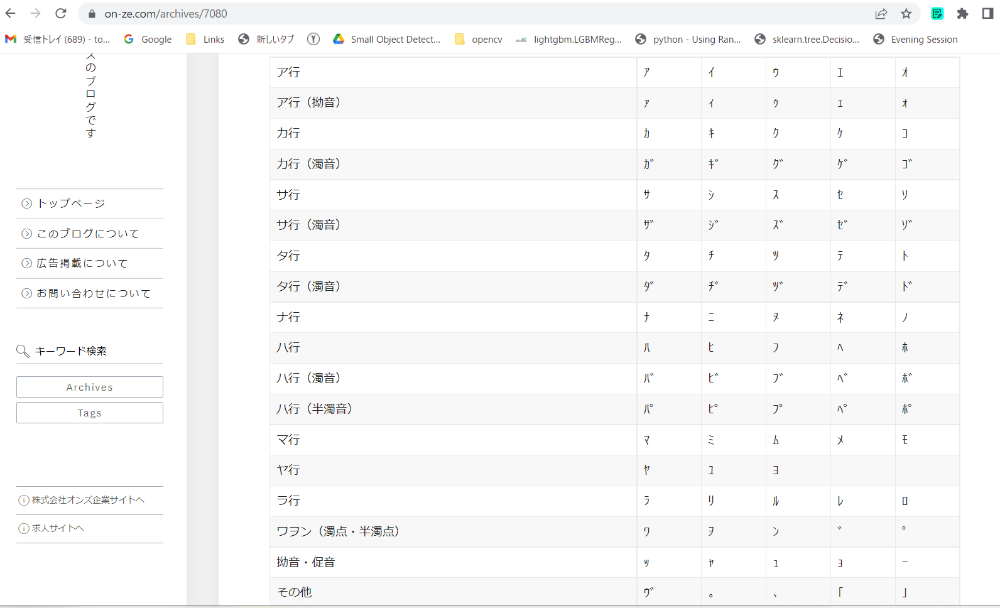
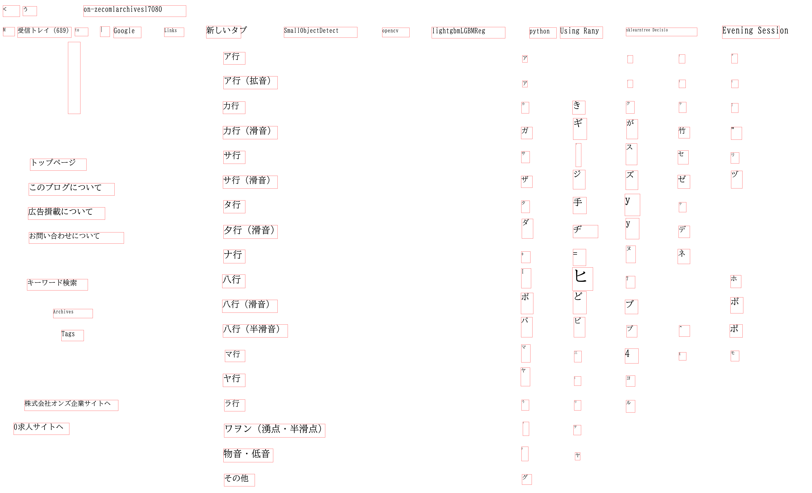

# EasyOCRTextBoxRecognizer
EasyOCR Text Box Reconginizer

This a simple command line client EasyOCR. 

<h2> 
1 Install 
</h2>
We use Python3 venv on Windows11 OS.
Please create a python venv (virtual env). 
<pre>
python -m ven c:\py38-ocr
</pre>
, and run the following command to activate the venv. 
<pre>
c:\py38-ocr\scripts\activate
</pre>

 
<h2>
2 Install python packages
</h2>
<pre>
pip install easyocr
pip uinstall pip uninstall opencv-python-headless
pip install -U opencv-python
</pre>

<h2>
3 Sample Program
</h2>
Please open Windows Powershell console, and run the following command in the console window. 

> python EasyOCRTextBoxRecognizer.py

 
This EasyOCRTextBoxRecognizer.py script reads the following recognition.conf file. 
<pre>
[parameter]
images_dir       = "./samples"
output_dir       = "./outputs"
image_format     = ".png"
gpu              = False
language_hints   = ['ja','en']

[preprocessor]
preprocessing    = True
gray_image       = True
image_scaling    = 3
constrast        = 2
sharpness        = 3

[visualizer]
font_name        = "BIZ-UDMinchoM.ttc"
draw_boundingbox = True

</pre>

Please note that we specify the language_hints in this config file to be "ja" to recognize Japanese text. 
You have to change this language_hints property depending on your text language. 

Example 1: 参考・教育漢字を除く常用漢字 
 
 

Text Box Recognition: 

 

Example 2: 付録常用漢字の一覧_付表 
 
 

Text Box Recognition: 

 

Example 3: 半角カタカナ一覧 
 
 

Text Box Recognition: 

 

Example 4: VSCodeScreenShot 
 
 

Text Box Recognition: 

 

Example 5: Symbols_Kakana 
 
 

Text Box Recognition: 

 

